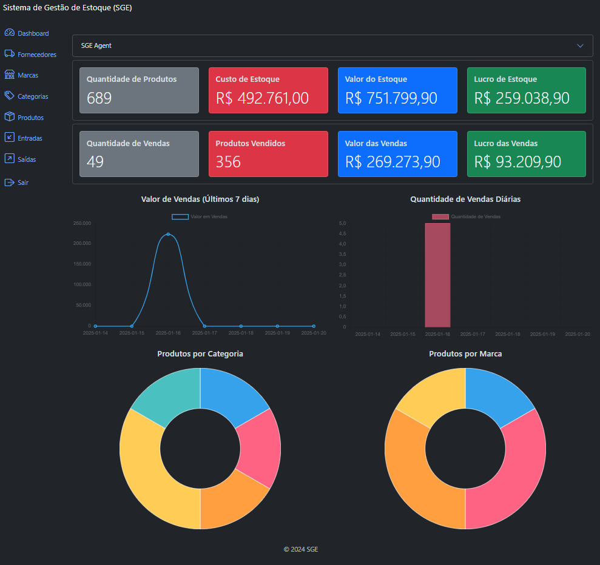

# Sistema de Gestão de Estoque (SGE)

Bem-vindo ao Sistema de Gestão de Estoque (SGE), um projeto desenvolvido em Django e Bootstrap 5 para facilitar o gerenciamento de estoque.
Foi realizada integração da Openai para insights sobre o estoque e vendas.

## Stack utilizada

O projeto foi desenvolvido utilizando as seguintes Stacks:

**Front-end:** Bootstrap 5 

**Back-end:** Python v2024.14.1, Django v5.1.3

**IA:** Openai API v1.59.7

## Instalação via download ZIP

1- Descompacte os arquivos<br>
2- Abra seu editor<br>
3- Vá em arquivo<br>
4- Abrir pasta<br>
5- Escolha a pasta do projeto (sge)<br>
6- Crie seu ambiente virtual utilizando o comando:<br>
    python -m venv "nome do ambiente de sua escolha"<br>
7- Acesse seu ambiente virtual criado através do comando:<br>
    .\"nome do ambiente de sua escolha"\Scripts\activate<br>
Você verá que o seu terminal ficara com o nome do seu ambiente entre parênteses e na cor verde, à esquerda do endereço do seu terminal.<br>
8- Instale as dependencias através do comando:<br>
    pip install -r requirements.txt<br>
9- Após o final da instalação, para rodar a aplicação será necessário executar o comando:<br>
    python manage.py runserver<br>

## Instalação via clonagem

Para rodar esse projeto, você vai precisar ter instalado em sua máquina as seguintes ferramentas:
[Git](https://git-scm.com)

Além disto é bom ter um editor para trabalhar com o código como [VSCode](https://code.visualstudio.com/)

1- Abra o Git Bash<br>
2- Altere o diretório de trabalho atual para o local do diretório desejado<br>
3- Digite git clone https://github.com/JG-Erbes-dev/sge.git<br>
4- Aperte ENTER e aguarde o final da clonagem<br>
5- Siga os passos 2 até 9 da instalação via download ZIP<br>

## Requisitos

Certifique-se de que você tenha os seguintes requisitos instalados em seu sistema:

- Python (versão recomendada: 3.7 ou superior)
- Django (instalado automaticamente ao seguir as instruções abaixo)
- Outras dependências listadas no arquivo `requirements.txt`


## Instalação das Dependências

Com o ambiente virtual ativado, instale as dependências do projeto usando o comando:
```bash
pip install -r requirements.txt
```


## Rodar o projeto

Após instalar as dependências, aplique as migrations no banco de dados com o comando:
```bash
python manage.py migrate
```

Agora o projeto jã pode ser inicializado com o comando:
```bash
python manage.py runserver
```

Após isso, o sistema estará pronto para ser acessado em:
[http://localhost:8000](http://localhost:8000)


# Exemplos

## Dashboard


## IA insight


## Lista de Produtos
